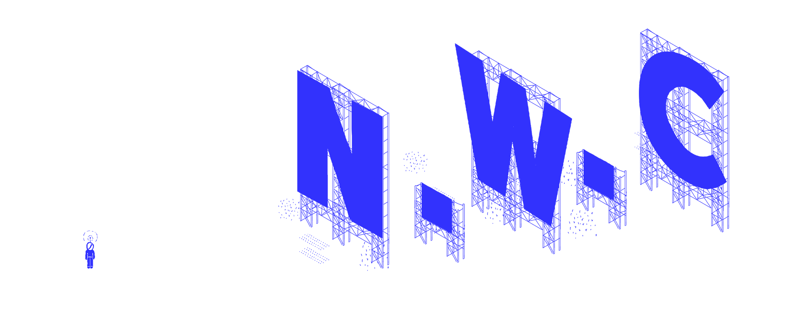
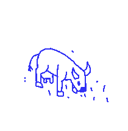

  
  

  # About
  
Search for hidden meaning of words in hand-drawn, interactive, miniature landscapes. Go explore our city, meet the locals, take a stroll on the beach or just go for a dance!  As we always say  TO-TO-DO!

  # Screenshots
  
  

      
             
    
               

# Trailer(Press The Cow)
  

# Check our itch page to play the game: 

  

# Credits
This game was made for Bezalel Academy of Arts and Design "Gaming Lab" course.

City creators - Guy Mizrachi, Nadav Baruch, Bar Nemesh and  Roi Shacham
